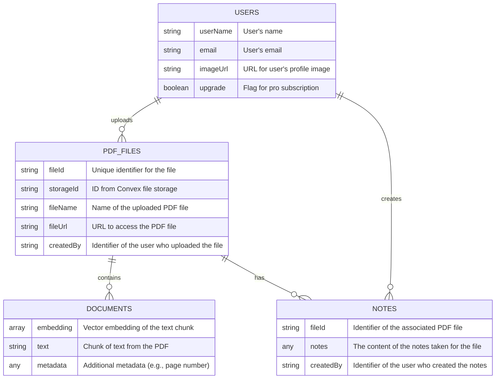

# Entity Relationship Diagram

This document provides an Entity Relationship (ER) Diagram for the project, illustrating the database schema and the relationships between different entities.

## Mermaid ER Diagram

### Explanation of Entities and Relationships

*   **USERS**: Represents the users of the application.
    *   A `USER` can upload multiple `PDF_FILES`. The relationship is one-to-many, linked by the `createdBy` field in the `PDF_FILES` table.
    *   A `USER` can create multiple `NOTES`. The relationship is one-to-many, linked by the `createdBy` field in the `NOTES` table.

*   **PDF_FILES**: Represents the PDF files uploaded by users.
    *   Each `PDF_FILE` is associated with one `USER`.
    *   Each `PDF_FILE` is broken down into multiple `DOCUMENTS` for vector embedding and search. This is a one-to-many relationship.
    *   Each `PDF_FILE` can have `NOTES` associated with it, linked by the `fileId`. This is a one-to-many relationship.

*   **DOCUMENTS**: Represents chunks of text extracted from the PDF files, along with their vector embeddings. This is used for similarity searches.
    *   Each `DOCUMENT` belongs to a single `PDF_FILE`.

*   **NOTES**: Represents the notes or summaries created by users for a specific PDF file.
    *   Each `NOTE` is associated with one `PDF_FILE` and one `USER`.